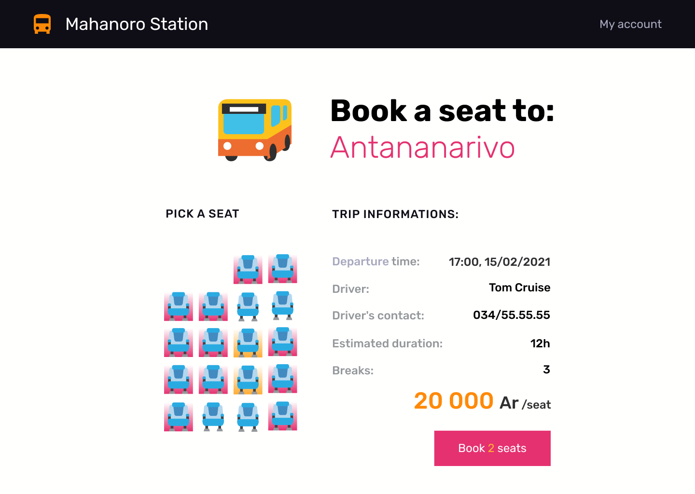

# Graded Project - Mahanoro Station

In this project our challenge is to build a website that will allow us to reserve some seats in ``Taxi brousses` departure from Mahanoro. Also we have to get it work with `redux`, `compound components` and `styled components`, and then make it lokk as close to the design as possible.
## Overview
This how my finish project look like:

## My demo
You can see my demo by clicking this link with the username[Betsimisaraka]()

## Built with
- [React]()
- [Redux]()
- [Compound components]()
- [Styled components]()
- [Html]()
## Fonctionality:
Users should be able to 
- pick a city from the city list,
- see the available trips to that city, and pick one where seats are still available.
- select one or more seats in the car, and see how much it's going to cost
- comfirm the booking
- see their comfirmed booking on the `My account` page
- Modify their own information, like name or phone number, on that same page.

## A brief explaination about the structure of my projects

## Improvement
## New things that I learned while working in this project
Using `redux` with `useReducer` is kind of new thing for me so I have learned a lot during this project. I learned about fetching data from an API with `redux` 
## Challenging part
## A new explaination about a specific topic
## How to use
